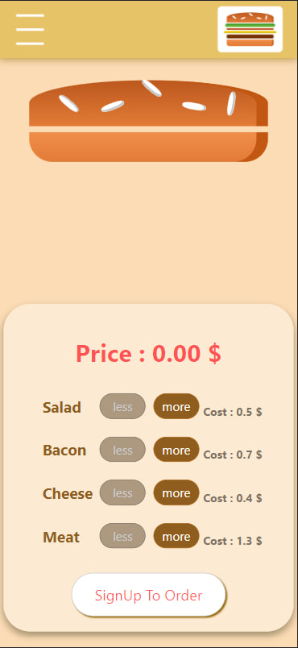
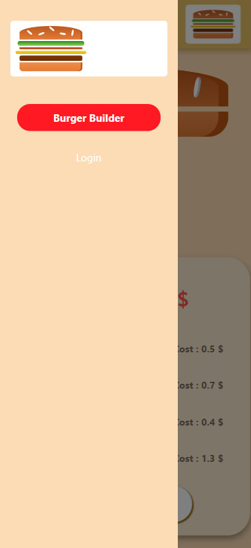
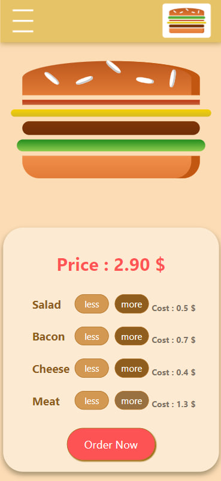
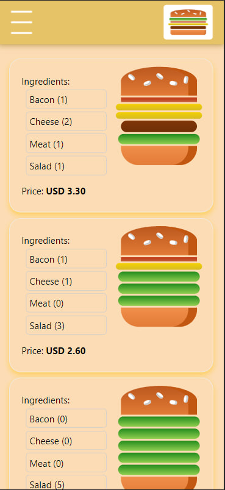

<h1 style="color:#facd8a ">Burger Delievery </h1>

#### Burger Delievery app built with React and Redux

## Available Scripts

In the project directory, you can run:

### `npm start`

<h1 style="color:#facd8a "> Front-end Technologies and liberaries </h1>

    - HTML
    - CSS
    - JavaScript
    - React.js
    - Redux
    - Authentication
    - material UI
    - FireBase 
    - Axios

<h1 style="color:#facd8a "> Usage</h1>

    - User can choose burger ingredients by pressing More and Less
    - Then user must be signed in to make order
    - User must signup with email
    - Third user will go to checkout page to fill form
    - User should enter true information in form to continue order
    - User will return to main page for making burger
    - User can see the orders in orders page    

  <h3 style="color:#facd8a ">Website Screenshot in mobile screen </h3>
      
     
    
    
    

<h1 style="color:#facd8a "> Check out Website Here </h1>

> [Youtube video](https://www.youtube.com/watch?v=7nq9xebmk40)
